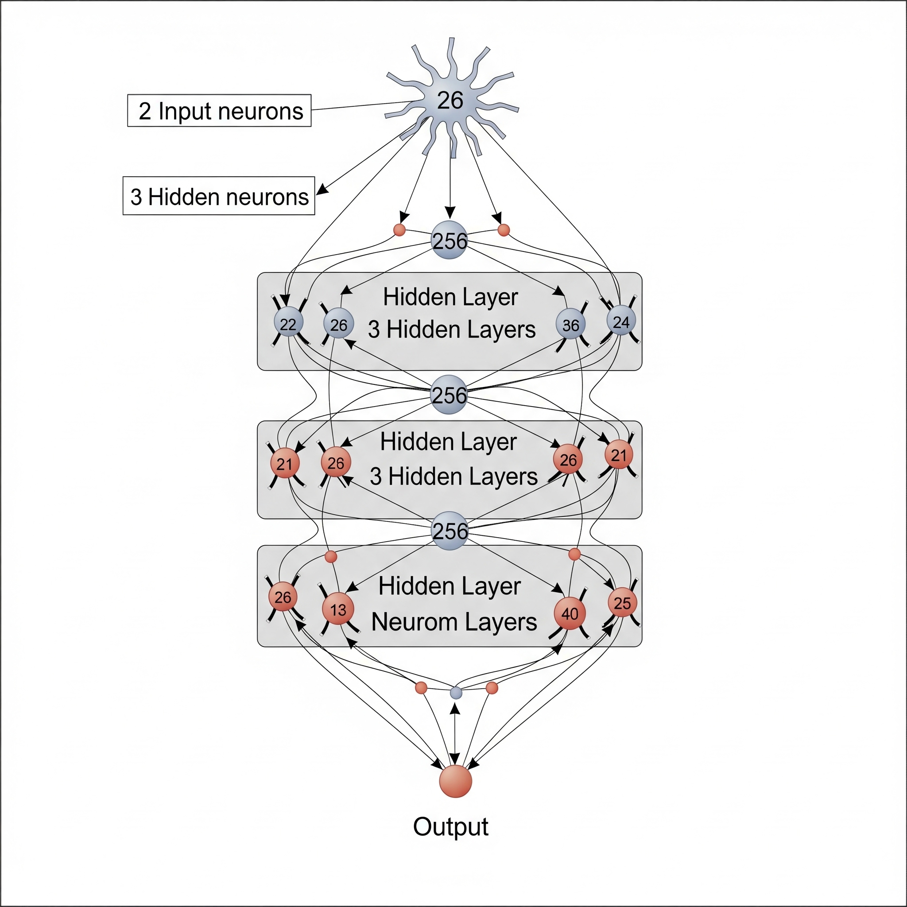
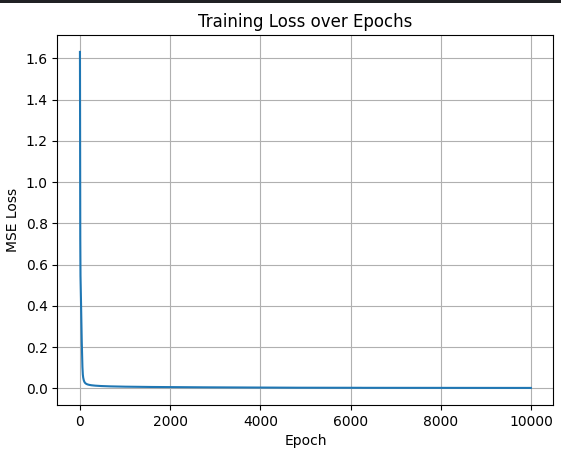

# 📸 SIREN - Image as a Continuous Neural Function


---

## 🚀 Project Overview

This project showcases **SIREN (Sinusoidal Representation Networks)**, a neural architecture capable of representing complex signals, such as images, as continuous functions. Unlike traditional grid-based image representations, SIRENs offer inherent advantages in tasks like image reconstruction, super-resolution, and even compression, by learning a highly accurate and infinitely differentiable mapping from coordinates to pixel values.

This interactive Streamlit application allows users to explore SIREN's capabilities in real-time, demonstrating its power in:
* **Grayscale & Color Image Reconstruction:** Reconstructing images from learned neural weights.
* **Super-Resolution (Upscaling):** Generating high-resolution images from low-resolution inputs by querying the continuous function at a denser grid.
* **Compression Analysis:** Comparing the SIREN model size to standard image compression techniques.
* **Advanced Visualizations:** PSNR metrics, detailed Heatmaps of differences, and interactive zoom features.

**[✨ Explore the Live Demo on Streamlit Cloud!](https://sirenapp-shivexpert.streamlit.app/)**

---

## 🧠 Core Mathematical & Architectural Principles 

This section delves into the foundational concepts that empower SIRENs to excel at continuous signal representation, highlighting key distinctions from conventional neural networks.

### 1. Robust Normalization for Sinusoidal Inputs

For SIRENs to effectively learn pixel intensities using sinusoidal activation functions, the input pixel values must be normalized to a specific range (typically `[-1, 1]`). I consciously opt for **min-max normalization** over methods like `sklearn`'s L2-norm-based normalization. The latter is primarily designed for feature vectors, where the Euclidean distance (L2 norm) is a meaningful measure across features. However, for pixel values, preserving the original intensity range and mapping it linearly to the activation function's optimal input range is crucial.

The standard min-max normalization formula is:

$$
 X_{\text{normalized}} = (X - \text{minval}) \times \frac{(\text{newmax} - \text{newmin})}{(\text{maxval} - \text{minval})} + \text{newmin}
$$


For pixel values in the range `[0, 255]` (typical for 8-bit images, including grayscale or individual color channels), and a target range for sinusoidal activations of `[-1, 1]` (`new_min = -1`, `new_max = 1`), this simplifies to:


$$
X_{\text{normalized}} = (X - 0) \times \frac{(1 - (-1))}{(255 - 0)} + (-1)
$$

$$
X_{\text{normalized}} = \left(\frac{X}{255}\right) \times 2 - 1
$$

This precise normalization ensures the input to the sine function spans its full, oscillating range, enabling the network to capture intricate signal details effectively.

### 2. The Indispensable Role of $\omega_0$ (Omega Zero) in Sinusoidal Activations

The unique performance of SIRENs largely stems from their use of sinusoidal activation functions (`sin(x)`) paired with a critical frequency scaling factor, $\omega_0$. Instead of directly using `sin(x)`, which tends to converge slowly, especially for representing higher-frequency signals $\omega_0$ as:

$$ \text{sin}(\omega_0 \cdot x) $$

This factor plays a **paramount role** in accelerating convergence and significantly enhancing the network's capacity to capture high-frequency details. A larger $\omega_0$ allows the network to represent sharper features and more complex textures.

Furthermore, a key theoretical advantage of sinusoidal activation functions is their **infinite differentiability**. Unlike common activation functions like ReLU or Tanh, which suffer from zero or piecewise-constant derivatives, sine functions allow SIRENs to maintain well-behaved gradients across all layers. This infinite differentiability is critical for capturing fine details, particularly when leveraging higher-order derivatives (e.g., for gradients in implicit neural representations).

Consider the derivatives of $y = \text{sin}(\omega_0 \cdot x)$:

$$
\frac{dy}{dx} = \omega_0 \cdot \cos(\omega_0 \cdot x)
$$

$$
\frac{d^2y}{dx^2} = -\omega_0^2 \cdot \sin(\omega_0 \cdot x)
$$

As evident, the magnitude of the gradient (and higher-order derivatives) is scaled up by factors of $\omega_0$ (or $\omega_0^2$, etc.). Consequently, **if $\omega_0$ is chosen to be sufficiently large (e.g., 30 for the first layer), it directly mitigates the problem of diminishing or vanishing gradients** that plague deeper networks using conventional activations. This allows SIRENs to build deeper architectures while maintaining strong signal propagation, a critical feature for learning complex signal representations.

---

## 🧠  My approach

* First, I preprocessed the image data by normalizing pixel coordinates to the range `[−1,1]`, which is essential for implicit neural representations to perform well spatially.
* Designed and implemented the SIREN architecture (Sine-activated Implicit Representation Network) completely from scratch in PyTorch.
* I have trained 2 models from complete scratch so you don't have too, the grayscale one is trained on ~20k epochs first 10k with 1e-4 lr and other 10k with 5e-5 lr.
* Adam optimizer is used.
* MSE is used as Loss.
* $\omega_0$ for first layer is 30 else 1.
  
* **Custom Activation and Weight Initialization:**
To correctly leverage these properties, a **custom sinusoidal activation function (`SineLayer`)** was implemented. This, in turn, necessitated a **tailored weight initialization strategy**, distinct from standard methods like He or Xavier initialization.

* **Why Not He/Xavier Initialization?**
He and Xavier initialization schemes are designed to maintain activation variances specifically for piecewise-linear (like ReLU) or squashing (like Tanh/Sigmoid) non-linearities. These methods are unsuitable for SIRENs because the periodic nature of sinusoidal activations requires a unique scaling to prevent issues like:
* **Gradient vanishing/exploding:** Improper initialization can lead to extremely small or large gradients across layers, hindering learning.
* **Poor frequency representation:** The initial state of the network's weights directly impacts its ability to represent high-frequency (fine) details in the signal.

My custom initialization, inspired by the principles outlined in the original SIREN paper 

$$
\text{Weight} \sim \mathcal{U}\left(-\frac{1}{\text{fanin}}, \frac{1}{\text{fanin}}\right)
$$

For subsequent hidden layers:

$$
\text{Weight} \sim \mathcal{U}\left(-\frac{\sqrt{6/\text{fanin}}}{\omega_0}, \frac{\sqrt{6/\text{fanin}}}{\omega_0} \right)
$$

**Note on Cosine Activations:**
While cosine activations could theoretically be employed, as `cos(x) = sin(x + \pi/2)`, using sine functions (specifically with the `omega_0` scaling) is generally preferred due to empirical observations of faster and more stable convergence for SIRENs.

---


## 🏗️ Model Architecture

* Concept i followed:
  
    `nn.Linear → Sine Activation → nn.Linear → Sine → ... → Final Output`

 
* Loss Curve after 10k epochs:
 

### Model Summary

The core Siren model utilized in this project, which learns the continuous image representation, has the following architecture:

```python
Siren(
  (net): Sequential(
    (0): Linear(in_features=2, out_features=256, bias=True)
    (1): sine_af()
    (2): Linear(in_features=256, out_features=256, bias=True)
    (3): sine_af()
    (4): Linear(in_features=256, out_features=256, bias=True)
    (5): sine_af()
    (6): Linear(in_features=256, out_features=256, bias=True)
    (7): sine_af()
    (8): Linear(in_features=256, out_features=1, bias=True)
  )
)
```
---


## 🛠️ Implementation Details

* **Framework:** Built with PyTorch for efficient tensor operations and neural network development.
* **Frontend:** Interactive web application powered by Streamlit.
* **Image Handling:** Utilizes NumPy, Pillow (PIL), and OpenCV for robust image loading, manipulation, and visualization.
* **Mathematical Visualization:** Matplotlib is used for generating insightful heatmaps.

---

## 🚀 Getting Started (Local Setup)

To run this application locally:

1.  **Clone the repository:**
    ```bash
    git clone [https://github.com/Shiv-Expert2503/SIREN_Streamlit.git](https://github.com/Shiv-Expert2503/SIREN_Streamlit.git)
    cd SIREN_Streamlit
    ```
2.  **Create and activate a virtual environment (recommended) with python 3.10:**
    ```bash
    python -m venv siren-env
    # On Windows:
    .\siren-env\Scripts\activate
    # On macOS/Linux:
    source siren-env/bin/activate
    ```
3.  **Install dependencies:**
    ```bash
    pip install -r requirements.txt
    ```
4.  **Download Pre-trained Models:**
    * Place my pre-trained `model_grayscale_1.pth`, `colored.pth`, etc., into a `models/` directory within your project root.
5.  **Run the Streamlit app:**
    ```bash
    streamlit run app.py
    ```
    The app will open in your default web browser.

---

## 💡 Future Enhancements

* Allow users to upload their own images for reconstruction/upscaling.
* Implement real-time training visualization (e.g., progress of reconstruction).
* Add more advanced SIREN variants or comparison with other INR methods.
* Explore compression benefits for higher resolution images more deeply.

---

## 🙏 Acknowledgements

* Inspired by the original SIREN paper: "[Implicit Neural Representations with Periodic Activation Functions](https://vsitzmann.github.io/siren/)" by Vincent Sitzmann et al.
* Built with ❤️ by shiv_expert.
* [Link to my Kaggle Notebook](https://www.kaggle.com/code/shivansh2503/image-compression)
